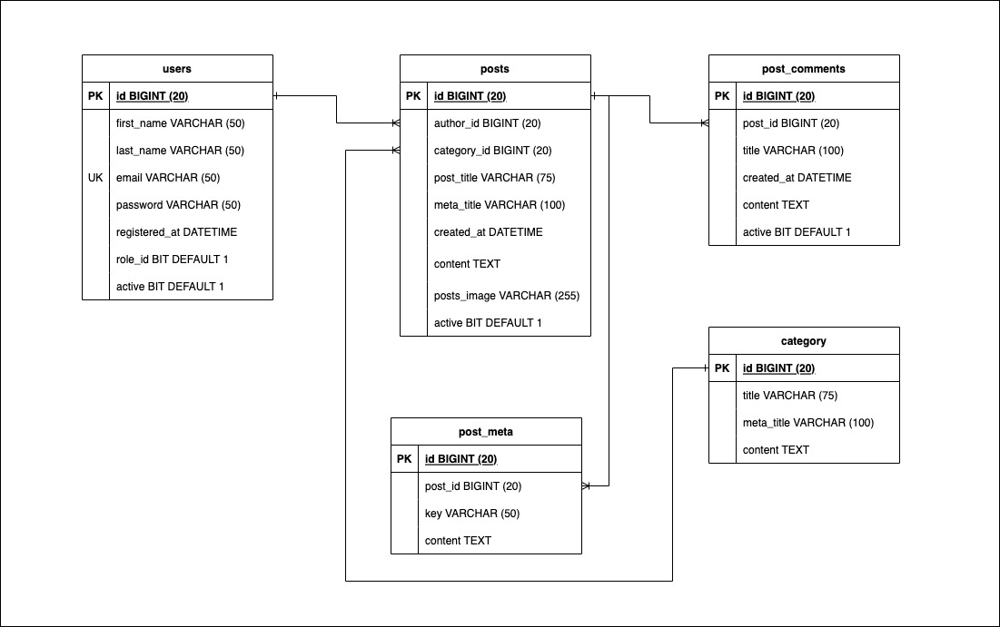

# minecraft-cms-website

### What the project does?

This is a CMS Website, which stores information about resources for the Minecraft. It has basic funtions like a wordpress-based blog. Logged-in users can publish posts, comment on posts. Administrative users can CUD tasks of users roles and review posts, comments of non-admin users before publishing them.

### What technologies are used?

- PHP is used for backend side
- HTML, CSS and JavaScript for front-end side
- MySQL for database

### Users roles:

There are three types of uses: non-users, users, and admins

- Non-users: they can view posts, pages of blog, but they can't comment on posts, or create posts
- Users: they can create and publish, edit, update posts of their own but they need get approved from admin. They can certainly comment on posts.
- Admins: they can do all CRUD, but they can publish posts, comments that are created by others (users, admins)

### Database structure and description:

### The goal of the project is building a cms website from scrach:

- Project planning and management
- Develop a database structure based on business's needs.
- Setup tools: Visual studio Code extension, database setup with XAMPP. For managing MySql database, I use DBeaver - a SQL client software application and a database administration tool. You can check it out here. https://dbeaver.io/
- Building the content management system CRUD for pages. The system will generate a website consisting of number of pages and data will be stored in database based on roles.
  - Admins and logged-in users
  - Non-administrative users
- Content search
- Validation and Security
- Layout and design
- Image upload and image processing
- Administrative Logins:
  - Admins can perform admin page CUD tasks
  - Usernames & passwords are stored in a users table with CRUD admin access
  - Passwords stored in database are hashed and salted
- User login:
  - Users can login to Admin portal
  - Users can register an account with a username and a password
- Deploy to a cloud service.
